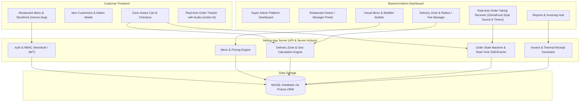
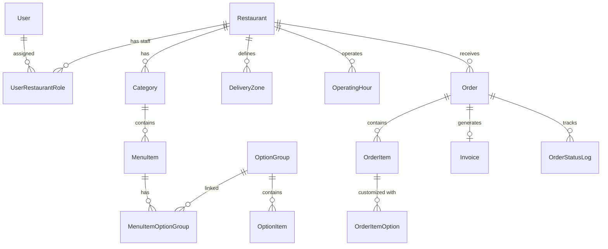

# Implementation Plan: GloriaFood-Inspired Online Restaurant Food Ordering System

An end-to-end, multi-tenant restaurant food ordering platform inspired by **GloriaFood** and **FoodBooking**. The system includes a high-converting customer-facing ordering storefront/widget, a real-time order-taking receiver console, and a permission-based multi-role backend administration dashboard powered by **Next.js (App Router)** and **MySQL** (via **Prisma ORM**).

---

## System Architecture Overview



---

## User Roles & Permissions (RBAC)

1. **SUPER_ADMIN (Platform Administrator)**:
   - Onboard & manage all restaurants (activate/deactivate, custom domain, subscription tier).
   - Global user management & permission assignment.
   - Platform-wide revenue, order metrics, and global billing logs.

2. **RESTAURANT_ADMIN (Restaurant Owner / Manager)**:
   - Configure restaurant profile (branding, address, tax rate, currency, opening hours).
   - Manage restaurant staff & operators.
   - Full CRUD on Menu (Categories, Items, Modifier Groups, Dietary tags).
   - Configure Delivery Zones (Radius/Polygon, Delivery Fees, Minimum Order requirements).
   - Configure Service Types (Delivery, Pickup, Dine-in/Table booking).
   - View Invoices, financial reports, customer receipts, and daily sales.

3. **KITCHEN_STAFF / ORDER_OPERATOR**:
   - Dedicated access to the **GloriaFood-style Real-Time Order Receiver**.
   - Sound alert for incoming orders, Accept with estimated prep time (e.g. +15m, +30m, +45m, custom), or Reject with structured reasons.
   - Real-time kitchen display view and thermal receipt printing (80mm kitchen ticket format).

4. **CUSTOMER (Guest or Registered)**:
   - Browse digital menu, filter by dietary requirements, customize items with modifiers.
   - Zone-validated checkout, ASAP or scheduled delivery/pickup.
   - Real-time order progress timeline with status animations.

---

## MySQL Database Schema Design (Prisma ORM)

### Core Entities & Relationships



### Prisma Schema Definition (`prisma/schema.prisma`)

```prisma
datasource db {
  provider = "mysql"
  url      = env("DATABASE_URL")
}

generator client {
  provider = "prisma-client-js"
}

enum Role {
  SUPER_ADMIN
  RESTAURANT_ADMIN
  STAFF_OPERATOR
  CUSTOMER
}

enum OrderType {
  DELIVERY
  PICKUP
  DINE_IN
}

enum OrderStatus {
  PENDING
  ACCEPTED
  PREPARING
  READY_FOR_PICKUP
  OUT_FOR_DELIVERY
  COMPLETED
  REJECTED
  CANCELLED
}

enum PaymentMethod {
  CASH_ON_DELIVERY
  CASH_ON_PICKUP
  CARD_ONLINE
  CARD_ON_DELIVERY
}

enum PaymentStatus {
  UNPAID
  PAID
  REFUNDED
}

model User {
  id            String               @id @default(uuid())
  name          String
  email         String               @unique
  passwordHash  String
  phone         String?
  role          Role                 @default(CUSTOMER)
  createdAt     DateTime             @default(now())
  updatedAt     DateTime             @updatedAt
  restaurantRoles UserRestaurantRole[]
  orders        Order[]
}

model Restaurant {
  id              String           @id @default(uuid())
  name            String
  slug            String           @unique
  description     String?          @db.Text
  logoUrl         String?
  bannerUrl       String?
  phone           String
  email           String
  address         String
  latitude        Float?
  longitude       Float?
  currency        String           @default("USD")
  currencySymbol  String           @default("$")
  taxRatePercent  Float            @default(0.0)
  enableDelivery  Boolean          @default(true)
  enablePickup    Boolean          @default(true)
  enableDineIn    Boolean          @default(false)
  autoAcceptOrders Boolean         @default(false)
  estimatedPrepTime Int            @default(25) // in minutes
  isActive        Boolean          @default(true)
  createdAt       DateTime         @default(now())
  updatedAt       DateTime         @updatedAt

  staffRoles      UserRestaurantRole[]
  categories      Category[]
  optionGroups    OptionGroup[]
  deliveryZones   DeliveryZone[]
  operatingHours  OperatingHour[]
  orders          Order[]
  invoices        Invoice[]
}

model UserRestaurantRole {
  id           String     @id @default(uuid())
  userId       String
  restaurantId String
  role         Role
  user         User       @relation(fields: [userId], references: [id], onDelete: Cascade)
  restaurant   Restaurant @relation(fields: [restaurantId], references: [id], onDelete: Cascade)

  @@unique([userId, restaurantId])
}

model Category {
  id           String      @id @default(uuid())
  restaurantId String
  name         String
  description  String?     @db.Text
  imageUrl     String?
  displayOrder Int         @default(0)
  isActive     Boolean     @default(true)
  restaurant   Restaurant  @relation(fields: [restaurantId], references: [id], onDelete: Cascade)
  items        MenuItem[]
}

model MenuItem {
  id            String                 @id @default(uuid())
  categoryId    String
  name          String
  description   String?                @db.Text
  imageUrl      String?
  basePrice     Float
  isAvailable   Boolean                @default(true)
  isFeatured    Boolean                @default(false)
  dietaryTags   String?                // Comma separated e.g. "Vegetarian,Spicy,Gluten-Free"
  displayOrder  Int                    @default(0)
  category      Category               @relation(fields: [categoryId], references: [id], onDelete: Cascade)
  optionGroups  MenuItemOptionGroup[]
  orderItems    OrderItem[]
}

model OptionGroup {
  id            String                 @id @default(uuid())
  restaurantId  String
  name          String                 // e.g. "Choose Size", "Extra Toppings", "Crust Type"
  minSelections Int                    @default(0) // 0 = optional, 1 = required single, 2+ = min required
  maxSelections Int                    @default(1) // 1 = radio button, >1 = checkboxes up to max
  restaurant    Restaurant             @relation(fields: [restaurantId], references: [id], onDelete: Cascade)
  items         OptionItem[]
  menuItems     MenuItemOptionGroup[]
}

model MenuItemOptionGroup {
  id            String       @id @default(uuid())
  menuItemId    String
  optionGroupId String
  displayOrder  Int          @default(0)
  menuItem      MenuItem     @relation(fields: [menuItemId], references: [id], onDelete: Cascade)
  optionGroup   OptionGroup  @relation(fields: [optionGroupId], references: [id], onDelete: Cascade)

  @@unique([menuItemId, optionGroupId])
}

model OptionItem {
  id            String            @id @default(uuid())
  optionGroupId String
  name          String            // e.g. "Large (+ $4.00)", "Extra Cheese (+ $1.50)"
  price         Float             @default(0.0)
  isDefault     Boolean           @default(false)
  isAvailable   Boolean           @default(true)
  displayOrder  Int               @default(0)
  optionGroup   OptionGroup       @relation(fields: [optionGroupId], references: [id], onDelete: Cascade)
  orderItemOptions OrderItemOption[]
}

model DeliveryZone {
  id              String      @id @default(uuid())
  restaurantId    String
  name            String      // e.g. "Zone 1 - 0-3km", "Downtown Express"
  zoneType        String      @default("RADIUS") // "RADIUS", "POLYGON", "POSTAL"
  radiusKm        Float?      // e.g. 5.0
  polygonGeoJson  String?     @db.LongText
  postalCodes     String?     @db.Text
  minOrderAmount  Float       @default(0.0)
  deliveryFee     Float       @default(0.0)
  freeDeliveryThreshold Float?
  estimatedTimeMin Int        @default(35)
  isActive        Boolean     @default(true)
  restaurant      Restaurant  @relation(fields: [restaurantId], references: [id], onDelete: Cascade)
}

model OperatingHour {
  id           String     @id @default(uuid())
  restaurantId String
  dayOfWeek    Int        // 0 = Sunday, 1 = Monday, ... 6 = Saturday
  openTime     String     // e.g. "10:00"
  closeTime    String     // e.g. "22:00"
  serviceType  OrderType  @default(DELIVERY)
  isClosed     Boolean    @default(false)
  restaurant   Restaurant @relation(fields: [restaurantId], references: [id], onDelete: Cascade)
}

model Order {
  id              String         @id @default(uuid())
  orderNumber     String         @unique // e.g. "#GF-10024"
  restaurantId    String
  userId          String?
  customerName    String
  customerEmail   String
  customerPhone   String
  orderType       OrderType      @default(DELIVERY)
  status          OrderStatus    @default(PENDING)
  deliveryAddress String?
  deliveryLat     Float?
  deliveryLng     Float?
  deliveryZoneId  String?
  specialNotes    String?        @db.Text
  subtotal        Float
  taxAmount       Float
  deliveryFee     Float          @default(0.0)
  discountAmount  Float          @default(0.0)
  totalAmount     Float
  paymentMethod   PaymentMethod  @default(CASH_ON_DELIVERY)
  paymentStatus   PaymentStatus  @default(UNPAID)
  scheduledFor    DateTime?
  acceptedAt      DateTime?
  estimatedReadyAt DateTime?
  rejectionReason String?
  createdAt       DateTime       @default(now())
  updatedAt       DateTime       @updatedAt

  restaurant      Restaurant     @relation(fields: [restaurantId], references: [id])
  user            User?          @relation(fields: [userId], references: [id])
  items           OrderItem[]
  statusLogs      OrderStatusLog[]
  invoice         Invoice?
}

model OrderItem {
  id            String             @id @default(uuid())
  orderId       String
  menuItemId    String?
  itemName      String
  itemPrice     Float
  quantity      Int                @default(1)
  itemTotal     Float
  specialNotes  String?
  order         Order              @relation(fields: [orderId], references: [id], onDelete: Cascade)
  menuItem      MenuItem?          @relation(fields: [menuItemId], references: [id])
  selectedOptions OrderItemOption[]
}

model OrderItemOption {
  id            String      @id @default(uuid())
  orderItemId   String
  optionItemId  String?
  groupName     String
  optionName    String
  optionPrice   Float       @default(0.0)
  orderItem     OrderItem   @relation(fields: [orderItemId], references: [id], onDelete: Cascade)
  optionItem    OptionItem? @relation(fields: [optionItemId], references: [id])
}

model OrderStatusLog {
  id          String      @id @default(uuid())
  orderId     String
  status      OrderStatus
  note        String?
  timestamp   DateTime    @default(now())
  order       Order       @relation(fields: [orderId], references: [id], onDelete: Cascade)
}

model Invoice {
  id             String        @id @default(uuid())
  invoiceNumber  String        @unique // e.g. "INV-2026-0001"
  orderId        String        @unique
  restaurantId   String
  subtotal       Float
  taxAmount      Float
  deliveryFee    Float
  totalAmount    Float
  paymentMethod  PaymentMethod
  paymentStatus  PaymentStatus
  pdfUrl         String?
  issuedAt       DateTime      @default(now())

  order          Order         @relation(fields: [orderId], references: [id], onDelete: Cascade)
  restaurant     Restaurant    @relation(fields: [restaurantId], references: [id])
}
```

---

## Detailed Module Breakdown & Features

### 1. Customer Ordering Frontend (FoodBooking / GloriaFood Experience)
- **Header & Restaurant Banner**: Logo, banner image, cuisine badges, rating, delivery & pickup availability pills with minimum order amounts.
- **Service Selector**: Toggle between **Delivery**, **Pickup**, and **Dine-In** with live time estimates.
- **Menu Directory**:
  - Sticky category navigation bar with smooth scrolling & counts.
  - Search bar with instant fuzzy matching.
  - Dietary filter pills (🌱 Vegetarian, 🌶️ Spicy, 🌾 Gluten-Free, 🥩 Halal).
  - High-res item cards with pricing, descriptions, and "Add to Cart" / "Choose Options" buttons.
- **Item Customization Modal (Modifier Engine)**:
  - Required single-choice groups (e.g. Size: Small / Medium / Large).
  - Multi-choice optional groups (e.g. Extra Toppings with maximum selection validation).
  - Real-time dynamic price calculator.
  - Special kitchen instructions field.
- **Smart Cart Drawer & Checkout Flow**:
  - Delivery Zone calculation (validates address distance/polygon against restaurant zones, applies dynamic delivery fee or triggers free delivery threshold).
  - Schedule selector: ASAP or pick date & time slot.
  - Customer contact details & payment method picker (Cash, Card on Delivery, Stripe/Card online).
- **Live Order Status Page with Audio Feedback**:
  - GloriaFood-style pulse animation, order status timeline, live restaurant acceptance countdown timer, and audio ringer on status changes.

### 2. Real-time Order Taking Receiver ("GloriaFood Order Receiver" Console)
- Designed for restaurant tablets or kitchen desktop screens.
- **Instant Audio Ringer**: Continuous alert chime when a new `PENDING` order arrives until kitchen staff acknowledges it.
- **Acceptance Action Panel**:
  - One-click accept with predefined prep times: `+15 min`, `+30 min`, `+45 min`, `+60 min`, or custom time.
  - Reject order with quick canned reasons ("Kitchen overloaded", "Item out of stock", "Address outside delivery radius", "Closing soon").
- **Kitchen Print Ticket / Thermal Receipt**:
  - One-click print formatted for standard 80mm ESC/POS thermal printers or regular PDF invoice print.
- **Live KanBan / Tabbed View**: `New (Pending)`, `In Kitchen (Accepted/Preparing)`, `Ready / Out for Delivery`, `Completed`.

### 3. Backend Multi-Role Admin Dashboard
- **Super Admin Platform Console**:
  - Manage all tenant restaurants (create, update, activate/suspend).
  - Global user directory with role assignment (`SUPER_ADMIN`, `RESTAURANT_ADMIN`, `STAFF_OPERATOR`).
  - Platform-wide sales and restaurant analytics.
- **Restaurant Management Hub**:
  - **Restaurant Profile**: Contact info, brand assets, tax rates, currencies, prep time defaults, toggle delivery/pickup.
  - **Operating Hours**: Weekly timetable with separate delivery vs pickup windows and temporary holiday closures.
  - **Menu & Modifier Builder**:
    - Drag-and-drop category & item reordering.
    - Modifier Groups builder (e.g., Pizza Sizes, Crusts, Sauces, Toppings) and linkage to single/multiple items.
    - Quick availability toggle (mark item Out of Stock in 1 click).
  - **Delivery Zone Manager**:
    - Radius-based (km) or distance rings.
    - Set per-zone minimum order amounts, base delivery fees, free delivery limits, and delivery duration.
  - **Invoice & Financial Center**:
    - Searchable invoice ledger with order details, tax breakdown, customer information, and printable PDF receipts.
  - **Analytics & Reports**:
    - Daily/Weekly/Monthly revenue, top-selling items, order distribution (Delivery vs Pickup), peak ordering hours.

---

## Technical Stack & Libraries

| Layer | Technology |
| :--- | :--- |
| **Framework** | Next.js 16 (App Router, Server Components & Server Actions) |
| **Language** | JavaScript / TypeScript / Modern ES |
| **Database** | MySQL (with Prisma ORM) |
| **Styling** | Tailwind CSS v4 + Vanilla CSS Design System (Aesthetic Dark/Light Glassmorphism & High-End Restaurant Theme) |
| **Icons** | Lucide React |
| **Real-time Engine** | Server-Sent Events (SSE) / Polling fallback with Audio Web Audio API |
| **Forms & Validation** | Zod / React Hook Form |
| **Receipts & Invoicing** | HTML5 Print Stylesheets / `@react-pdf` / Thermal 80mm CSS template |

---

## Step-by-Step Implementation Roadmap

### Phase 1: Database & Backend Core
- [ ] Initialize **Prisma ORM** with MySQL connection.
- [ ] Create `schema.prisma` with all entities (`User`, `Restaurant`, `Category`, `MenuItem`, `OptionGroup`, `OptionItem`, `DeliveryZone`, `Order`, `OrderItem`, `Invoice`, etc.).
- [ ] Create database seed script with sample restaurants (e.g. Italian Pizza & Pasta, Gourmet Burgers), categories, modifier groups, delivery zones, and pre-configured admin/operator accounts.
- [ ] Implement secure authentication & RBAC middleware/helpers.

### Phase 2: Restaurant Storefront & Customer Experience
- [ ] Build restaurant menu page (`/menu/[restaurantSlug]`) with sticky category nav, search, and dietary tags.
- [ ] Build interactive Item Customizer Modal supporting single-select & multi-select modifier rules.
- [ ] Build Zone-Aware Slide-Over Cart & Checkout page with delivery zone fee calculation and ASAP/Scheduled time slots.
- [ ] Build Customer Live Order Tracking page (`/order/[orderId]`) with real-time status updates and GloriaFood audio/animation.

### Phase 3: GloriaFood-Style Real-time Order Taking Receiver Console
- [ ] Build `/admin/live-orders` receiver console with audio alert system when new pending orders drop.
- [ ] Implement quick-accept (+15m, +30m, etc.) and reject modals with live customer push notifications.
- [ ] Implement 80mm thermal receipt / kitchen print view.

### Phase 4: Backend Admin Management Suite
- [ ] Build Admin Navigation Layout with role-based routing (`/admin`).
- [ ] Build Visual Menu Management (Categories, Items, Option Groups & Addons builder).
- [ ] Build Delivery Zone & Pricing Manager (Radius/Postal zones, minimum order, fee calculation).
- [ ] Build Restaurant Profile & Operating Hours Schedule editor.
- [ ] Build Invoices & Financial Ledger module.
- [ ] Build User & Staff Management with role assignments.
- [ ] Build Analytics Dashboard with revenue charts & top item metrics.

### Phase 5: Verification & Polish
- [ ] Test end-to-end customer order placement -> real-time alert in kitchen receiver -> order acceptance -> customer tracking update -> invoice generation.
- [ ] Verify multi-zone delivery calculation & minimum order thresholds.
- [ ] Ensure responsive layout on desktop, tablet (kitchen receiver), and mobile (customer ordering).

---

## Verification Plan

### Automated & Database Verification
1. Run Prisma database migration and seed: `npx prisma db push` and `node prisma/seed.js`.
2. Verify all tables, relations, and foreign keys in MySQL.
3. Test Server Actions & API endpoints for menu querying, zone calculation, order creation, status transitions, and invoice generation.

### Manual Verification Flows
1. **Customer Order Flow**:
   - Visit `/menu/bellavista-pizza`.
   - Filter menu items by dietary tag (e.g. Vegetarian).
   - Customize a Pizza (Select "Large", "Stuffed Crust", add "Extra Mozzarella").
   - Open Cart, enter delivery address, verify correct delivery zone and fee calculation.
   - Complete checkout with Cash on Delivery.
2. **Kitchen Operator Order Receiver Flow**:
   - Keep `/admin/live-orders` open in a separate browser tab.
   - Observe real-time order arrival sound and pulsing alert.
   - Click "Accept (+30 min)" and verify the order moves to "Preparing".
   - Open thermal receipt print preview.
3. **Live Order Tracking**:
   - Check the customer tab at `/order/:id` and verify the status instantly updates to "Accepted (30 min prep time)" with progress timeline.
4. **Admin Panel Management**:
   - Log in as Restaurant Admin at `/admin`.
   - Add/Edit a Menu item, create a new modifier group, and update delivery zone pricing.
   - Check Invoices tab to view auto-generated invoice for the completed order.
